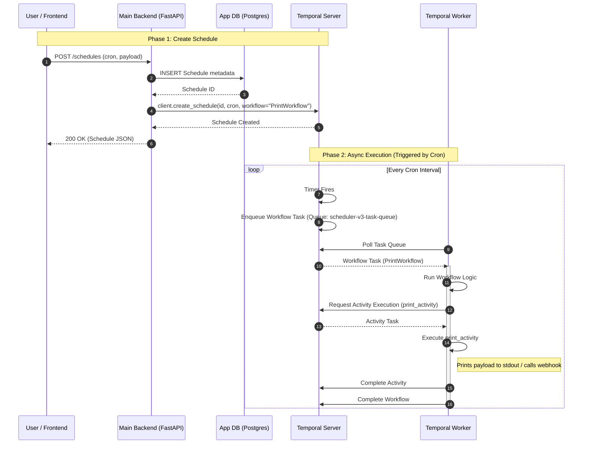

# Scheduler V3 Walkthrough (Temporal)

This document explains the architecture and flow of `scheduler_v3`, which uses Temporal to manage distributed scheduling and task execution.

## System Components

1.  **User / Frontend**: Clients interacting with the HTTP API (e.g., `curl`, Postman, or a web UI).
2.  **Main Backend (`main.py`)**: FastAPI application.
    -   Manages application-specific metadata in PostgreSQL (`schedules` table).
    -   Acts as a **Temporal Client**, creating and updating Schedules in the Temporal Cluster.
3.  **Temporal Server**: The core Temporal Cluster (Frontend, History, Matching, Worker services).
    -   Manages the state of Schedules, Workflows, and Activities.
    -   Persists state to its own PostgreSQL database.
4.  **Worker (`worker.py`)**: A Python process running the Temporal Worker.
    -   Polls the `scheduler-v3-task-queue`.
    -   Executes the `PrintWorkflow`, `SagaWorkflow` and associated activities.

## Sequence Diagram

The following diagram illustrates the lifecycle of a schedule: from creation to execution.



## Key Workflows

### 1. Creating a Schedule
When `POST /schedules` is called:
1.  **Local Persistence**: The schedule details (Cron, URL, Payload) are saved to the local application database for querying and UI display.
2.  **Temporal Schedule**: A corresponding **Temporal Schedule** is created using the same ID. This object lives on the Temporal Server and manages the timing.
    -   It is configured to trigger `PrintWorkflow` or `SagaWorkflow` at the specified intervals.

### 2. Execution
At the scheduled time:
1.  **Temporal Server** triggers the schedule.
2.  It starts a new execution of the configured workflow.
3.  This places a task on the `scheduler-v3-task-queue`.
4.  The **Worker** (which could be running on any machine) picks up the task and executes the activities.

### 3. SAGA Pattern Demonstration
The scheduler supports a `SagaWorkflow` to demonstrate distributed transactions with compensating actions.

#### Overview
The SAGA pattern manages distributed transactions where if a step fails, compensating actions undo changes from previous steps.

#### Workflow (A -> B -> C)
1.  **Workflow**: Executes Activity A -> Activity B -> Activity C.
2.  **Failure Simulation**: Each activity has a configurable failure rate.
3.  **Compensation**:
    -   If Activity A succeeds, `compensate_a` is added to the stack.
    -   If Activity B succeeds, `compensate_b` is added.
    -   If Activity C fails (after retries), the workflow executes compensations in reverse order (`compensate_b` -> `compensate_a`).

#### API Usage for SAGA
To create a SAGA schedule:

```bash
curl -X POST "http://localhost:8091/schedules" \
  -H "Content-Type: application/json" \
  -H "X-User-ID: test-user" \
  -d '{
    "cron_expression": "* * * * *",
    "workflow_type": "saga",
    "saga_payload": {
        "failure_rate": 0.3,
        "activities": ["A", "B", "C"]
    },
    "tags": {"env": "demo"}
  }'
```

#### Verification
Check worker logs for execution flow:
-   **Success**: Executed A -> Executed B -> Executed C
-   **Failure**: Executed A -> Executed B -> Failed C -> Compensated B -> Compensated A -> SAGA Failed

## Updating / Deleting
-   **Update**: Updates both the local DB record and the Temporal Schedule spec (e.g., changing the Cron expression).
-   **Delete**: Deletes the local DB record and triggers a deletion of the Temporal Schedule.
