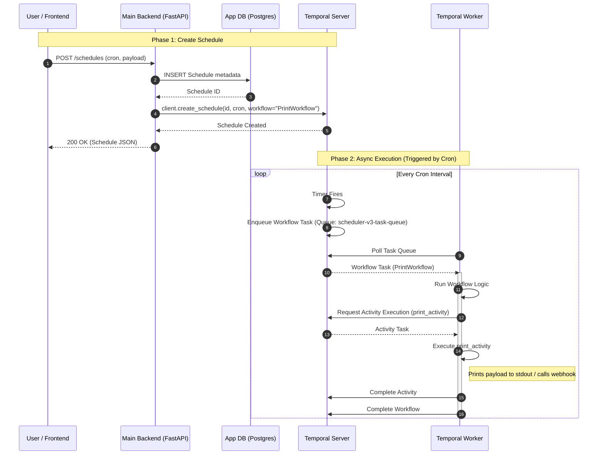

# Scheduler V3 Walkthrough (Temporal)

This document explains the architecture and flow of `scheduler_v3`, which uses Temporal to manage distributed scheduling and task execution.

## System Components

1.  **User / Frontend**: Clients interacting with the HTTP API (e.g., `curl`, Postman, or a web UI).
2.  **Main Backend (`main.py`)**: FastAPI application.
    -   Manages application-specific metadata in PostgreSQL (`schedules` table).
    -   Acts as a **Temporal Client**, creating and updating Schedules in the Temporal Cluster.
3.  **Temporal Server**: The core Temporal Cluster (Frontend, History, Matching, Worker services).
    -   Manages the state of Schedules, Workflows, and Activities.
    -   Persists state to its own PostgreSQL database.
4.  **Worker (`worker.py`)**: A Python process running the Temporal Worker.
    -   Polls the `scheduler-v3-task-queue`.
    -   Executes the `PrintWorkflow` and `print_activity`.

## Sequence Diagram

The following diagram illustrates the lifecycle of a schedule: from creation to execution.

## Key Workflows

### 1. Creating a Schedule
When `POST /schedules` is called:
1.  **Local Persistence**: The schedule details (Cron, URL, Payload) are saved to the local application database for querying and UI display.
2.  **Temporal Schedule**: A corresponding **Temporal Schedule** is created using the same ID. This object lives on the Temporal Server and manages the timing.
    -   It is configured to trigger `PrintWorkflow` at the specified intervals.

### 2. Execution
At the scheduled time:
1.  **Temporal Server** triggers the schedule.
2.  It starts a new execution of `PrintWorkflow`.
3.  This places a task on the `scheduler-v3-task-queue`.
4.  The **Worker** (which could be running on any machine) picks up the task.
5.  The Worker executes the `print_activity`, which currently prints the payload to the console.
    -   *In a real scenario, this would perform the actual HTTP webhook call.*

### 3. Updating / Deleting
-   **Update**: Updates both the local DB record and the Temporal Schedule spec (e.g., changing the Cron expression).
-   **Delete**: Deletes the local DB record and triggers a deletion of the Temporal Schedule.
